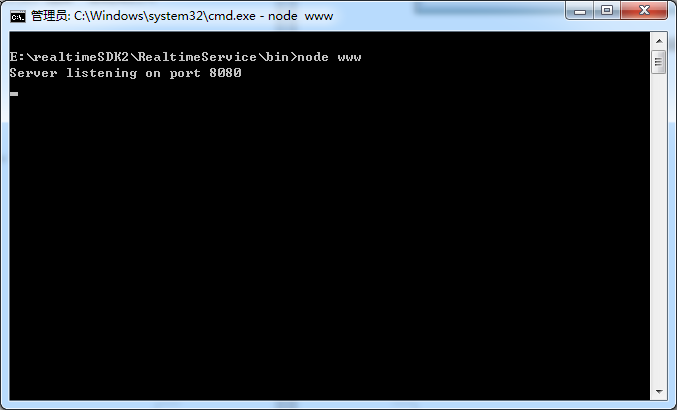

[TOC]

# 1、realtime solution brief introduction

Based on Sysolution Realtime SDK, using web technology and http communication (be good at JavaScript), this is a quick development solution although with limited functions. 

Necessary Preparation：

- Know html+css
- Be good at JavaScript
- At least know one back-end develop language（C#, JAVA, PHP, nodejs,etc）

## 1.1、Realtime Diagram


# 2、Realtime server environment buildup

## 2.1、brief introduction

- This solution only workable for users who have knowledge of web technology, can visit any website by using loadUrl interface,Provide invokeJs to call javascript method in current webpage (can transfer text data via this method) to realize real time display, users can customize define display interface and logic.
- This Solution provides two types of language : Java version and Nodejs version, recommend to use Nodejs version for Linux system
- traits of Java : more stable service and multi-threading
- traits of Nodejs: easier to install and build up

## 2.2、Install

- Java：install the correct jdk according to the operation system and setup environment variable, support java1.8 and above.   
- nodejs： Install the correct nodejs according to the Server operation system, download link：*https://nodejs.org/download/release/v4.4.7/ ,recommend to download nodejs 4.4.7 and above. The SDK contains the application for windows 64bit and 32bit system. 

## 2.3、Run realtimeServer（nodejs）

windows system: press Shift key meanwhile right click “RealtimeServer” folder in SDK, then choose “Open command window here” and input node bin\www



## 2.4、Setup realtime service and run (JAVA)

open  harbour.properties config file, modify port, database address, user name, password and connection pool. can jump database configuration if no need.

```xml
server.port : service port

uselog : use log file or not

callback_url : callback address after controller accessing

db.host : database address+port
db.user : database user name
db.password : database password

db.maxPoolSize : maximum connections for connecting pool, default is 30
db.acquireIncrement : Number of increased connections  per each time, default is 6
db.maxIdleTime : Maximum idle seconds per connection, default 1800
```

harbour.properties  example:

```xml
server.port = 9000

uselog = true

callback_url = http://localhost/mng/aaa/aaa

db.host = localhost:3306
db.user = root
db.password = 123456

db.maxPoolSize = 30
db.acquireIncrement = 6
db.maxIdleTime = 1800
```

windows system：press shift keyboard, right click the folder that contains harbour.jar,  select "Open command window here", then input java -jar harbour.jar  command to run up application. If a tip 'java' is not an internal or external command, then need install java running environment. 


linux system：nohup java -jar harbour.jar &

nohup  means not hanging up the running command, the program still runs when the account exits or the terminal is closed. 

when adopt nohup command to execute job, By default, all the output of the job is redirected to the file of nohup.out unless otherwise specified.

## 2.4、setup server address for controllers

please  visit [(https://www.sysolution.net/news/software-download-73889.html)]  ，and download LEDOK express software : 

/image/%E6%96%87%E6%A1%A3%E5%9B%BE%E7%89%871.jpg)

download and install LEDOK express software success, then normally software will auto detect the controller IP address. 

/image/%E6%96%87%E6%A1%A3%E5%9B%BE%E7%89%872.png)

click Terminal control button, click advanced parameter button, password 888, enter the configuration interface (include uninstall apk and upgrade apk)

/image/%E6%96%87%E6%A1%A3%E5%9B%BE%E7%89%873.png)

then input the realtime server 's host IP and port, default port 8081 click set


then will see TIP message： success 

/image/%E6%96%87%E6%A1%A3%E5%9B%BE%E7%89%874.png)

after connecting success, realtime server interface will show following information 


## 2.5、modify realtime port（nodejs）

if need to modify realtimeServer's monitor port, then enter the realtimServer catalogue of sdk, open config.js file by using text editor, change 8081 into any other port number. 

